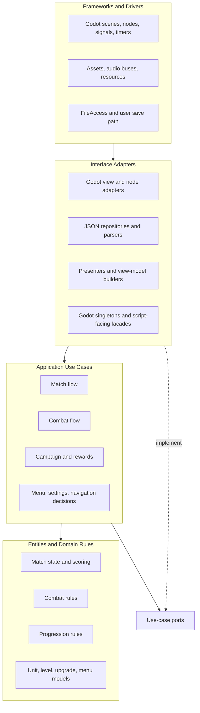
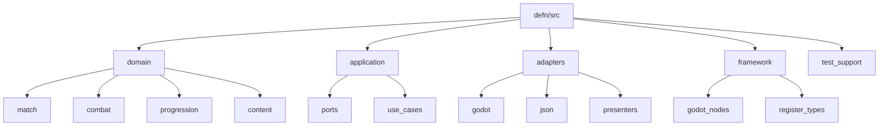
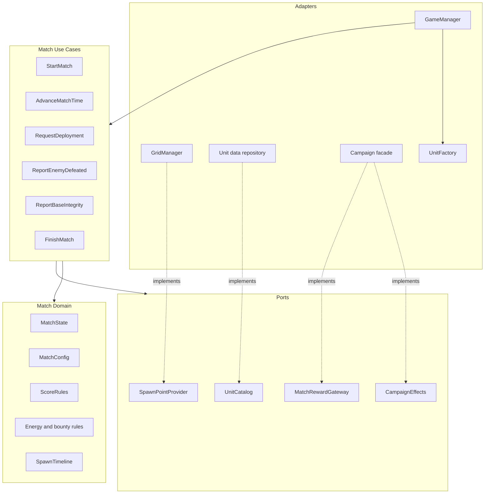
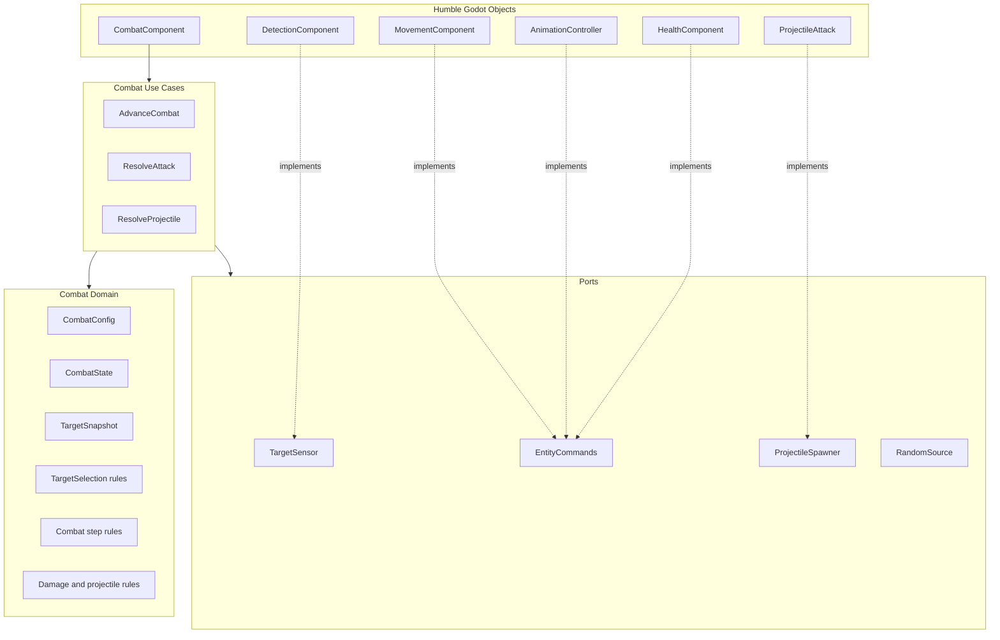
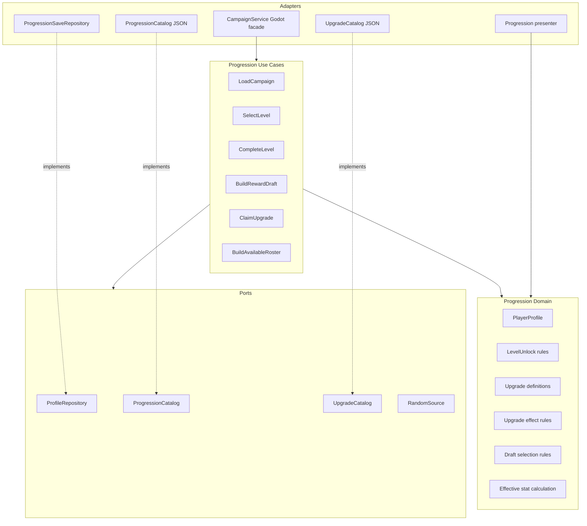
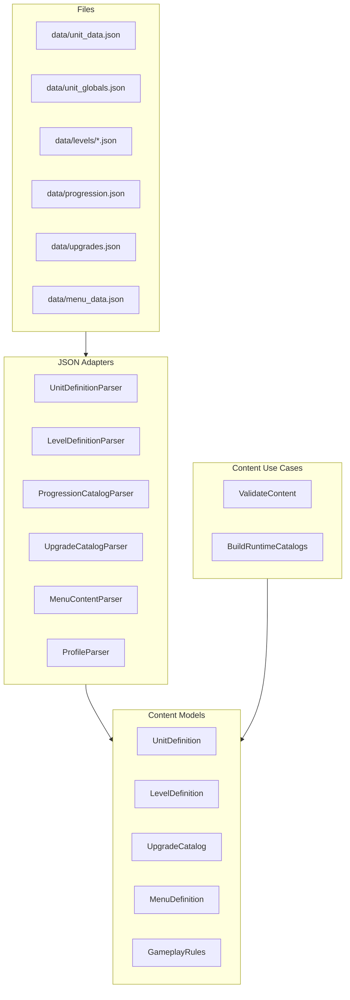
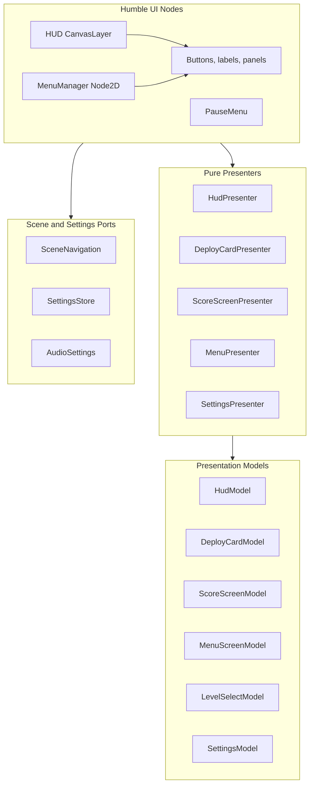
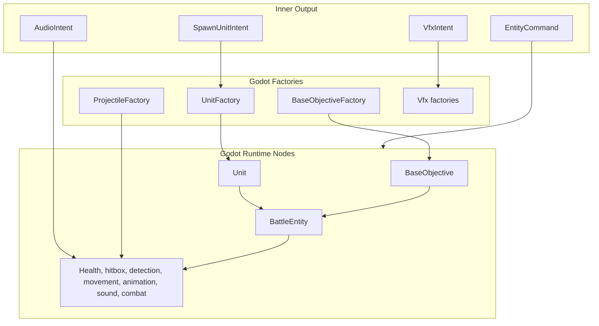
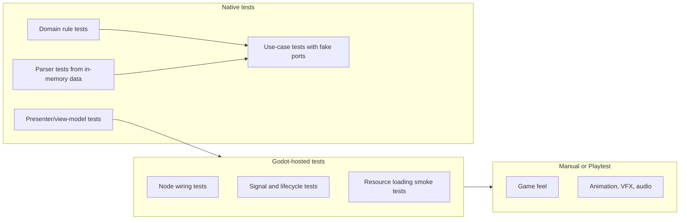

# Target Architecture

## Purpose

Defn should move toward a small Clean Architecture shape: game rules live in plain C++ modules, use cases coordinate those rules through narrow ports, and Godot classes stay as humble adapters that translate engine events into use-case calls and use-case output into nodes, visuals, audio, and scene navigation.

The goal is not a large rewrite or an enterprise framework. The goal is to make the important behavior easy to test without Godot while keeping the Godot-facing code straightforward.

## Current Architecture Summary

The current codebase is already partly aligned with this direction.

- The game is code-first Godot through GDExtension. `GameManager` and `MenuManager` are scene-root nodes that create most runtime objects in C++.
- Runtime match orchestration is split across `GameManager`, `MatchDirector`, `MatchSession`, `DeploymentService`, and `SpawnScheduler`.
- `MatchSession`, `DeploymentService`, `SpawnScheduler`, and `combat_logic` are already close to testable application/domain code.
- `Unit` and `BaseObjective` inherit from `BattleEntity`, and most entity behavior is componentized through health, hitbox, detection, movement, animation, sound, and combat components.
- `CombatComponent` is a good humble-object precedent: it is a Godot `_process` adapter around `CombatRuntime` and `combat_logic`.
- `CampaignService` currently combines several responsibilities: Godot singleton registration, save loading/saving, progression rules, upgrade draft selection, effective stat calculation, and presentation model building.
- Data loading uses `FileAccess`, `JSON`, `Dictionary`, and `Variant` directly in loaders such as `UnitDataLoader`, `LevelLoader`, `MenuDataLoader`, `ProgressionCatalog`, `UpgradeCatalog`, and `ProgressionSaveRepository`.
- Native tests cover several rule-heavy slices, while hosted tests are used for engine-backed behavior.

The target architecture should preserve the good direction that already exists and make the dependency rule explicit.

## Clean Architecture Dependency Rule

Source dependencies point inward. Inner code must not know about outer code.

Dependency rules:

- Domain code contains deterministic rules and data models. It must not derive from `Object`, `Node`, `Node2D`, `CanvasLayer`, or any other Godot class.
- Use cases coordinate domain objects and depend on ports, not concrete repositories, Godot singletons, scene trees, timers, or nodes.
- Interface adapters translate between Godot/JSON concepts and use-case/domain concepts.
- Framework code owns Godot lifecycle, file access, resources, node construction, and engine callbacks.
- Cross-boundary calls pass value objects, IDs, snapshots, commands, and intents rather than `Node *` whenever possible.
- Godot value types such as `String`, `Vector2`, and `Color` can remain temporarily where they keep migration small, but the target inner model should prefer engine-neutral value types for code that must be native-testable without Godot startup.

## Humble Object Policy

A humble object is allowed to know the framework but should contain as little decision-making as possible. In this project, all Godot nodes should trend humble.

Humble Godot objects should:

- create and own nodes;
- connect and emit signals;
- read input and lifecycle callbacks;
- collect snapshots from the scene;
- call use cases;
- apply returned intents to movement, animation, health, VFX, audio, UI, or navigation.

Humble Godot objects should not:

- decide campaign unlocks, scoring, upgrade eligibility, target priority, combat timing, deployment affordability, or wave completion;
- parse business data directly into rule objects without a parser/repository boundary;
- own random selection logic that cannot be seeded in tests;
- require native tests to instantiate Godot nodes just to test rules.

Good current examples to preserve:

- `CombatComponent` delegates `_process` work to `CombatRuntime`.
- `combat_logic` returns intent-like outputs that can be tested directly.
- `DeploymentService` returns a `DeploymentResult` instead of spawning nodes itself.
- `MatchDirector` returns `MatchUpdate` objects that `GameManager` applies to Godot.

Target refinements:

- `GameManager` becomes a `GameSceneAdapter` in practice: it wires scene nodes and delegates match decisions.
- `HUD` and `MenuManager` become view adapters: they render view models and emit user intents.
- `Unit`, `BaseObjective`, and components become runtime adapters around domain state and commands.
- `CampaignService` becomes a thin Godot-facing facade over progression use cases.

## Target Source Layout

Physical folders can be migrated incrementally. The important part is ownership and dependency direction.

Recommended directory intent:

- `domain/`: pure rules and data structures.
- `application/`: use-case classes, input/output DTOs, and ports.
- `adapters/json/`: `FileAccess`/`JSON` parsing, save serialization, catalog repositories.
- `adapters/presenters/`: pure view-model builders that do not create Godot controls.
- `adapters/godot/`: implementations of ports backed by Godot APIs.
- `framework/godot_nodes/`: concrete `Node`, `Node2D`, `CanvasLayer`, and GDExtension classes.

For a small project, do not introduce all folders at once. Move a file only when it clarifies a real dependency boundary or enables a useful test.

## Module 1: Match Runtime

The match runtime should own the core loop: start match, advance time, deploy units, account for deaths, update base integrity, detect victory/defeat, and build match-end outputs.

Current files that map into this module:

- `MatchSession` is the seed for `MatchState`, `EconomyRules`, and `ScoreRules`.
- `DeploymentService` is the seed for `RequestDeployment`.
- `SpawnScheduler` should split into a pure `SpawnTimeline` plus a use-case-owned clock advance.
- `MatchDirector` is currently a use-case coordinator, but should stop knowing concrete loaders and `Unit *`.
- `GameManager` should continue to apply `MatchUpdate`/intent outputs to Godot.

Target match outputs should be plain values:

- `SpawnUnitIntent { unit_id, side, position, runtime_profile }`
- `ResourceChanged { energy }`
- `WaveChanged { current_wave, total_waves }`
- `ScoreChanged { kill_score, total_score }`
- `MatchEnded { victory, summary_model, reward_options }`

The match use cases should not materialize `Unit` nodes. They should ask adapters to materialize spawn intents.

## Module 2: Combat and Entity Runtime

Combat is the best existing pattern for the target design. Keep pushing decisions into pure logic and keep Godot components as adapters.

Target combat flow:

1. A Godot component collects target snapshots from areas and entity adapters.
2. A combat use case advances deterministic combat state.
3. The use case returns commands: stop, move, play pose, hide muzzle flash, deal damage, spawn projectile, play effect.
4. The Godot component applies commands to `MovementComponent`, `AnimationController`, `HealthComponent`, `ProjectileAttack`, and VFX/audio adapters.

Key refinement: `combat_logic` currently depends on `AttackTarget *` and Godot `Vector2`. The target should pass stable entity IDs or handles plus plain positions in the inner logic. Godot nodes can maintain the handle-to-node map outside the domain.

## Module 3: Progression and Rewards

Progression should split the current `CampaignService` responsibilities into rules, use cases, repositories, presenters, and a Godot facade.

Target responsibilities:

- `PlayerProfile` remains a plain save model.
- Upgrade eligibility, level unlocks, effective unit stats, and rescue draft thresholds move into deterministic progression rules.
- Draft selection accepts an injected `RandomSource` so tests can use seeded or scripted randomness.
- Persistence becomes a `ProfileRepository` port implemented by the JSON save adapter.
- `CampaignService` remains available to Godot as a singleton, but it delegates to progression use cases rather than owning all rules directly.
- Presentation functions such as reward titles, subtitles, upgrade cards, owned-upgrade summaries, and level-select rows should be pure presenters over progression outputs.

This is the highest-value split because it removes the current mix of singleton, file I/O, random selection, rule calculation, and presentation building from one class.

## Module 4: Content and Data Loading

Content loading should be an adapter layer. Parsed content should become plain domain content models before use cases consume it.

Target guidelines:

- Keep `load_from_data` style tests, but isolate `Dictionary`/`Variant` parsing in JSON adapters.
- Let repositories own `FileAccess`; do not let use cases open files.
- Keep content validation pure after parsing. `ContentValidator` should validate already-loaded models and return a report, while an outer startup adapter decides how to print or fail.
- Avoid stringly typed action decisions in use cases. Parse menu actions, upgrade effects, and unit sides into enums/value objects at the adapter boundary.

## Module 5: Presentation, UI, and Scene Flow

UI nodes should render view models and emit user intents. Navigation decisions should come from use cases; actual `SceneTree` calls stay in Godot adapters.

Target responsibilities:

- `HUD` renders a `HudModel` and emits `DeployRequested`, `UpgradeSelected`, `NextLevelRequested`, `RetryRequested`, and `MainMenuRequested` intents.
- `MenuManager` renders a `MenuScreenModel` and emits menu intents rather than deciding all actions itself.
- `SceneNavigator` implements a navigation port. Use cases decide desired destinations; only the adapter calls `change_scene_to_file`, `quit`, or equivalent Godot APIs.
- Settings logic should be a use case over a `SettingsStore` and Godot-backed settings adapters for display, resolution, vsync, and bus volume.

`ScoreScreenPresenter` currently creates Godot UI. The target split is:

- pure `ScoreScreenPresenter`: build text, button states, reward card view models;
- Godot `ScoreScreenView`: create controls and connect callbacks.

## Module 6: Godot Entity Construction

Entity construction should stay outside the inner rules. The domain says what should exist; Godot factories decide how to create nodes.

Target guidelines:

- `UnitFactory` remains a Godot adapter because it calls `memnew`, attaches child nodes, and connects signals.
- Runtime profiles are useful and should remain value objects passed into factories.
- `Unit` should expose snapshots and apply commands, not decide rules beyond local setup.
- Randomized range variation should move out of `Unit::set_unit_config` and into a seeded domain/application step that produces a resolved runtime config. The node should receive the resolved values.
- `BattleEntity` can stay as a shared Godot adapter base, but inner rules should interact with entity IDs or snapshots rather than requiring `BattleEntity *`.

## Ports and Boundaries

Use ports only where they remove a real dependency. Avoid making an interface for every helper.

High-value ports:

| Port | Implemented by | Used by | Why |
| --- | --- | --- | --- |
| `UnitCatalog` | unit-data repository | deployment, spawn, roster use cases | Removes `UnitDataLoader` and JSON from use cases. |
| `LevelRepository` | level JSON repository | match start use case | Removes `LevelLoader` and file paths from match logic. |
| `ProfileRepository` | save JSON repository | progression use cases | Makes save/load testable. |
| `ProgressionCatalog` | progression JSON repository | progression rules | Keeps unlock data data-driven. |
| `UpgradeCatalog` | upgrades JSON repository | progression rules | Keeps upgrade definitions data-driven. |
| `SpawnPointProvider` | `GridManager` adapter | deployment and spawn use cases | Keeps Godot/world geometry at the edge. |
| `RandomSource` | Godot or standard RNG adapter | draft selection, resolved combat ranges | Enables deterministic tests. |
| `SceneNavigation` | `SceneNavigator` adapter | menu and post-match flow | Keeps `SceneTree` out of use cases. |
| `SettingsStore` | Godot display/audio adapter plus save file adapter | settings use case | Keeps OS/window/audio APIs at the edge. |

Low-value ports to avoid initially:

- wrappers around simple math functions;
- interfaces for every presenter;
- interfaces for one-off pure helpers;
- a dependency injection container.

Construct dependencies manually from scene roots or a small composition root.

## Testing Strategy

Native tests should cover:

- scoring, energy, bounty, and victory/defeat rules;
- deployment affordability and spawn-intent generation;
- wave timeline advancement;
- combat target selection and attack timing;
- projectile/splash math;
- progression unlocks, upgrade effects, draft eligibility, and deterministic draft selection;
- content parser behavior from in-memory dictionaries or JSON text;
- presenter output models.

Hosted tests should cover:

- Godot node creation and component wiring;
- signal connections;
- `GameManager` and `MenuManager` adapter smoke tests;
- resource paths and scene registration;
- save path integration.

The native suite should be the default place for behavior. Hosted tests should prove that the humble objects are wired correctly.

## Incremental Migration Plan

1. Write down and enforce the dependency rule for new files: domain and application code cannot include Godot node classes or call engine singletons.
2. Split `CampaignService` first. Keep the public Godot singleton facade, but move profile mutations, unlock checks, effective stat calculation, and draft selection into progression rules/use cases.
3. Introduce `RandomSource` for upgrade drafts and range variation. Add deterministic tests for draft selection and resolved unit combat ranges.
4. Split `SpawnScheduler` into a pure timeline plus an adapter/use-case wrapper that obtains level data and spawn points.
5. Turn `UnitDataLoader`, `LevelLoader`, and catalog loaders into repositories/parsers that produce content models. Keep `load_from_data` tests as migration safety checks.
6. Continue the combat pattern by removing `AttackTarget *` from inner combat selection. Use entity IDs and target snapshots internally; let Godot adapters map IDs back to nodes when applying commands.
7. Split UI presenters from UI construction. Start with score screen and deploy cards, since they already have presenter-like classes.
8. Rename classes only when the behavior has moved. Avoid a folder-only refactor that changes paths without improving testability.

## Practical Rules for Future Features

When adding a feature, use this checklist:

- Can the rule be tested without creating a Godot node? If not, move the rule inward.
- Does a use case return an intent or value model instead of mutating UI/nodes directly?
- Does a Godot class mostly translate lifecycle/signals/input into use-case calls and apply returned output?
- Are file I/O, resources, scene navigation, display settings, audio buses, and random numbers behind adapters or injected values?
- Is the test in the cheapest layer that can prove the behavior?

## Things Not to Do

- Do not rewrite the game into a full ECS just to be architectural.
- Do not add a dependency injection container.
- Do not create abstract interfaces for every concrete class.
- Do not move every file into new folders before behavior is isolated.
- Do not make Godot-hosted tests the only way to test rules.
- Do not let `GameManager` or `CampaignService` accumulate new gameplay decisions.

## Desired End State

The desired end state is a project where the game can be understood in two passes:

1. Read domain and application code to understand how Defn plays, scores, progresses, deploys, spawns, and resolves combat.
2. Read Godot adapters to understand how those decisions appear on screen and how engine events enter the application.

That keeps the architecture simple: rules are plain and testable, Godot objects are humble, and data-driven content remains easy to change without hiding business logic inside scene code.