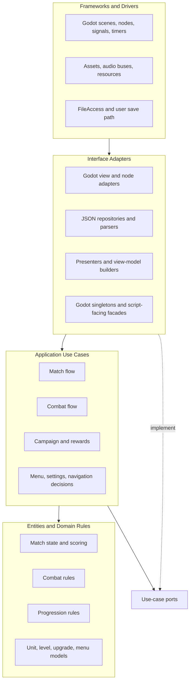
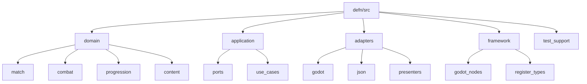
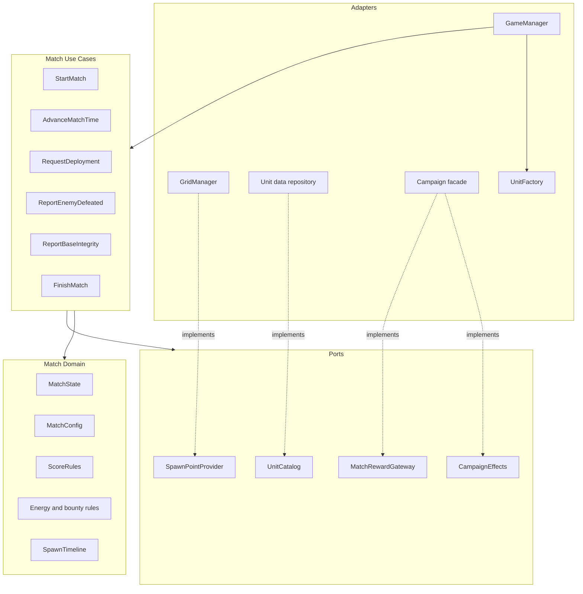
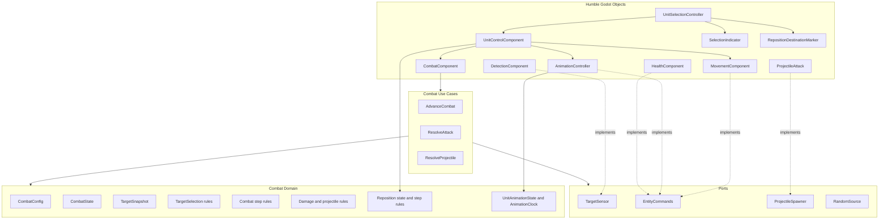
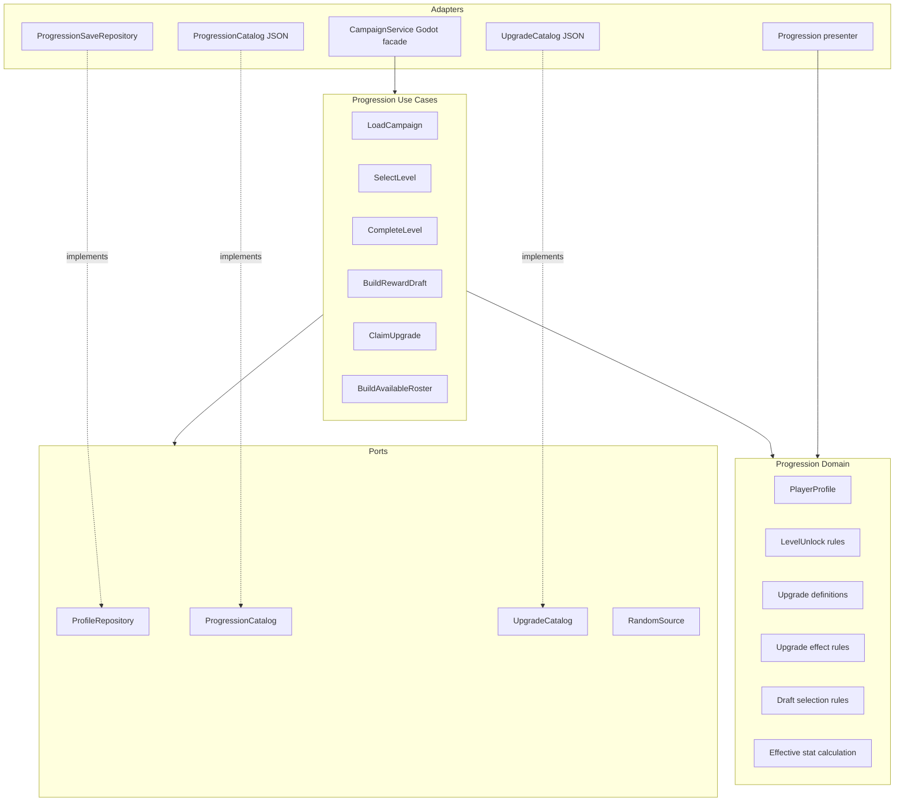
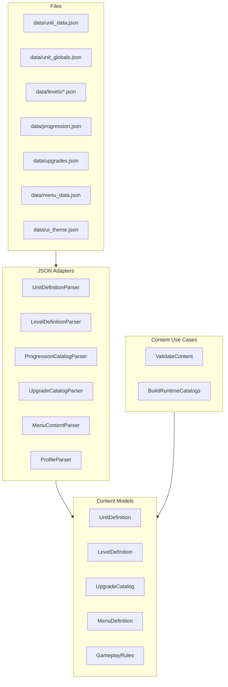
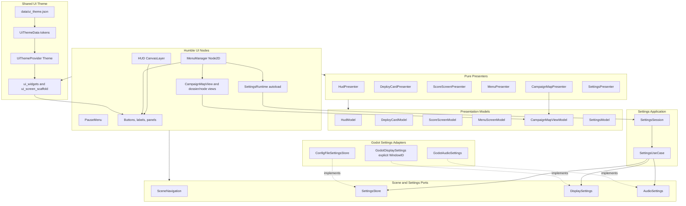
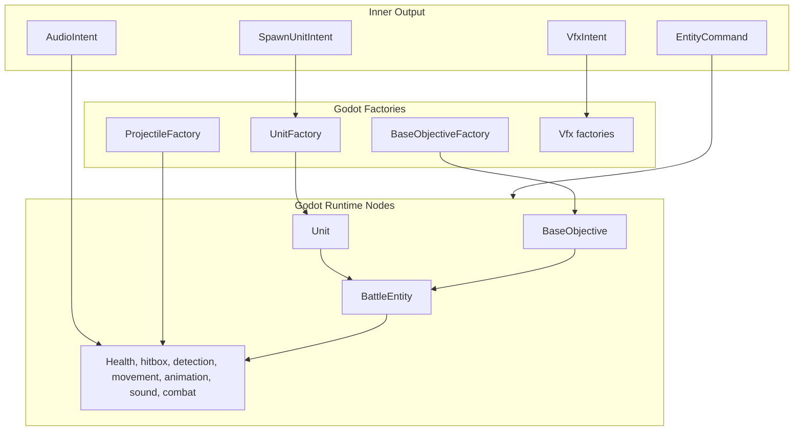
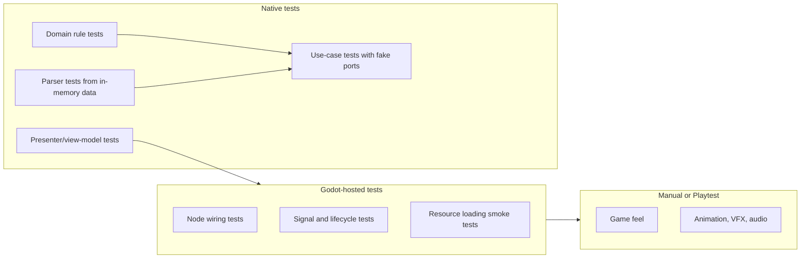

# Target Architecture

Clean Architecture (Robert Martin): game rules live in plain C++ modules, use cases coordinate those rules through narrow ports, and Godot classes stay as humble adapters that translate engine events into use-case calls and use-case output into nodes, visuals, audio, and scene navigation.

The goal is the important behavior to be easy to test without Godot while keeping the Godot-facing code straightforward.

## Clean Architecture Dependency Rule

Source dependencies point inward. Inner code must not know about outer code.

```mermaid
flowchart TB
    subgraph Drivers[Frameworks and Drivers]
        Godot[Godot scenes, nodes, signals, timers]
        Assets[Assets, audio buses, resources]
        Files[FileAccess and user save path]
    end

    subgraph Adapters[Interface Adapters]
        GodotAdapters[Godot view and node adapters]
        JsonAdapters[JSON repositories and parsers]
        Presenters[Presenters and view-model builders]
        Facades[Godot singletons and script-facing facades]
    end

    subgraph UseCases[Application Use Cases]
        MatchFlow[Match flow]
        CombatFlow[Combat flow]
        CampaignFlow[Campaign and rewards]
        MenuFlow[Menu, settings, navigation decisions]
    end

    subgraph Domain[Entities and Domain Rules]
        MatchRules[Match state and scoring]
        CombatRules[Combat rules]
        ProgressionRules[Progression rules]
        ContentModels[Unit, level, upgrade, menu models]
    end

    Drivers --> Adapters
    Adapters --> UseCases
    UseCases --> Domain

    Adapters -. implement .-> Ports[Use-case ports]
    UseCases --> Ports
```

Dependency rules:

- Domain code contains deterministic rules and data models. It must not derive from `Object`, `Node`, `Node2D`, `CanvasLayer`, or any other Godot class.
- Use cases coordinate domain objects and depend on ports, not concrete repositories, Godot singletons, scene trees, timers, or nodes.
- Interface adapters translate between Godot/JSON concepts and use-case/domain concepts.
- Framework code owns Godot lifecycle, file access, resources, node construction, and engine callbacks.
- Cross-boundary calls pass value objects, IDs, snapshots, commands, and intents rather than `Node *` whenever possible.
- Godot value types such as `String`, `Vector2`, and `Color` should not be named from within inner circles. The model should prefer engine-neutral value types for code that must be native-testable without Godot startup.

## Humble Object Policy

A humble object is allowed to know the framework but should contain as little decision-making as possible. In this project, all Godot nodes should trend humble.

Humble Godot objects should:

- create and own nodes;
- connect and emit signals;
- read input and lifecycle callbacks;
- collect snapshots from the scene;
- call use cases;
- apply returned intents to movement, animation, health, VFX, audio, UI, or navigation.

Humble Godot objects should not:

- decide campaign unlocks, scoring, upgrade eligibility, target priority, combat timing, deployment affordability, or wave completion;
- parse business data directly into rule objects without a parser/repository boundary;
- own random selection logic that cannot be seeded in tests;
- require native tests to instantiate Godot nodes just to test rules.

## Target Source Layout

The important part is ownership and dependency direction.

```mermaid
flowchart TB
    Src[defn/src]

    Src --> Domain[domain]
    Domain --> DomainMatch[match]
    Domain --> DomainCombat[combat]
    Domain --> DomainProgression[progression]
    Domain --> DomainContent[content]

    Src --> App[application]
    App --> AppPorts[ports]
    App --> AppUseCases[use_cases]

    Src --> Adapters[adapters]
    Adapters --> GodotAdapter[godot]
    Adapters --> JsonAdapter[json]
    Adapters --> PresenterAdapter[presenters]

    Src --> Framework[framework]
    Framework --> GodotNodes[godot_nodes]
    Framework --> Registration[register_types]

    Src --> TestsSupport[test_support]
```

Recommended directory intent:

- `domain/`: pure rules and data structures.
- `application/`: use-case classes, input/output DTOs, and ports.
- `adapters/json/`: `FileAccess`/`JSON` parsing, save serialization, catalog repositories.
- `adapters/presenters/`: pure view-model builders that do not create Godot controls.
- `adapters/godot/`: implementations of ports backed by Godot APIs.
- `framework/godot_nodes/`: concrete `Node`, `Node2D`, `CanvasLayer`, and GDExtension classes.

## Boundary Inventory and Ownership

The `domain/` and `application/` trees are engine-neutral. They must not include
`godot_cpp`, name `godot::` types, or invoke Godot APIs. Engine values are
converted only in `adapters/` or `framework/` code.

Current boundary ownership:

- `MatchDirector` and `SpawnScheduler` use `std::string`, level definitions,
  ports, and match intents. `GameManager` converts their level labels and
  background paths to Godot `String` values when rendering the scene.
- `ContentValidator` consumes `ContentValidationInput`, a plain value model of
  campaign-map, menu, progression, upgrade, unit, and level data, and returns
  `std::vector<std::string>` issues. `JsonContentRepository` converts parsed
  Godot-backed catalog values into that input; `ContentStartupValidator` owns
  Godot logging.
- `GridManager` answers the spawn-point queries and is the only grid code that
  draws randomness. Belt-Y sampling goes through the injected `RandomSource`
  rather than a Godot utility call, so a seeded source makes spawn placement
  reproducible.
- `CameraScrollController` is engine-neutral and lives in `domain/match`. Both
  spawn positions are measured from where the camera is looking, so scrolling
  is a gameplay rule rather than a view concern. `GameManager` keeps the Godot
  half: it applies the returned position to a `Camera2D` and publishes it to
  `GridManager`.
- `GameManager` is the match-level composition and lifecycle entry point. It
  delegates camera movement to `CameraScrollController`, backgrounds to
  `GameBackgroundBuilder`, node creation to `BaseObjectiveFactory` and
  `UnitFactory`, and match decisions to `MatchDirector`.
- `SettingsRuntime` is a narrow process-level autoload and settings composition
  boundary. The current root-scene replacement flow requires it to persist
  independently of `menu.tscn` and `game.tscn`. It owns one engine-neutral
  `SettingsSession` plus the ConfigFile, audio, and explicit-window display
  adapters; editor, embedded, and headless capability checks stay at this outer
  boundary. Godot recovery mode disables the GDExtension and may therefore log
  that the `SettingsRuntime` class cannot be instantiated from its autoload
  scene; this diagnostic is expected, and the project remains openable so the
  extension can be restored for a normal launch.
- `SettingsSession` owns the process-scoped `SettingsState`, starts
  idempotently, coordinates `SettingsUseCase`, and persists each mutation.
- `MenuManager` is a framework UI adapter. It delegates menu decisions and
  screen models to `MenuFlowUseCase` and presenter builders, renders a settings
  snapshot, and forwards settings intents to `SettingsRuntime`. The
  level-selection composition mounts one full-screen `CampaignMapView` directly
  under its UI layer and supplies progression access plus navigation callbacks.
  `CampaignMapView` first presents its loading overlay, then owns synchronous
  campaign/level definition composition and threaded texture requests before it
  passes plain campaign state to `CampaignMapPresenter` and builds the map UI.
  Preview framing and Godot controls remain adapter concerns.

Keep these translations at the edge. A new engine-facing value in domain or
application code is an architectural regression, not a convenience shortcut.

## Module 1: Match Runtime

The match runtime should own the core loop: start match, advance time, deploy units, account for deaths, update base integrity, detect victory/defeat, and build match-end outputs.

```mermaid
flowchart TB
    subgraph MatchDomain[Match Domain]
        MatchState[MatchState]
        MatchConfig[MatchConfig]
        ScoreRules[ScoreRules]
        EconomyRules[Energy and bounty rules]
        SpawnTimeline[SpawnTimeline]
    end

    subgraph MatchUseCases[Match Use Cases]
        StartMatch[StartMatch]
        AdvanceMatchTime[AdvanceMatchTime]
        RequestDeployment[RequestDeployment]
        ReportEnemyDefeated[ReportEnemyDefeated]
        ReportBaseIntegrity[ReportBaseIntegrity]
        FinishMatch[FinishMatch]
    end

    subgraph MatchPorts[Ports]
        UnitCatalogPort[UnitCatalog]
        SpawnPointPort[SpawnPointProvider]
        CampaignEffectsPort[CampaignEffects]
        MatchRewardPort[MatchRewardGateway]
    end

    subgraph MatchAdapters[Adapters]
        GameManagerAdapter[GameManager]
        GridManagerAdapter[GridManager]
        UnitDataRepository[Unit data repository]
        CampaignFacade[Campaign facade]
        UnitFactoryAdapter[UnitFactory]
    end

    GameManagerAdapter --> MatchUseCases
    MatchUseCases --> MatchDomain
    MatchUseCases --> MatchPorts
    GridManagerAdapter -. implements .-> SpawnPointPort
    UnitDataRepository -. implements .-> UnitCatalogPort
    CampaignFacade -. implements .-> CampaignEffectsPort
    CampaignFacade -. implements .-> MatchRewardPort
    GameManagerAdapter --> UnitFactoryAdapter
```

Current files that map into this module:

- `MatchSession` is the seed for `MatchState`, `EconomyRules`, and `ScoreRules`.
- `DeploymentService` is the seed for `RequestDeployment`.
- `SpawnScheduler` should split into a pure `SpawnTimeline` plus a use-case-owned clock advance.
- `MatchDirector` is currently a use-case coordinator, but should stop knowing concrete loaders and `Unit *`.
- `GameManager` should continue to apply `MatchUpdate`/intent outputs to Godot.

Match outputs are plain values:

- `SpawnUnitIntent { unit_id, side, position, runtime_profile }`
- `ResourceChanged { energy }`
- `WaveChanged { current_wave, total_waves }`
- `ScoreChanged { kill_score, total_score }`
- `MatchEnded { victory, summary_model, reward_options }`

Match use cases do not materialize `Unit` nodes. Godot adapters materialize spawn intents.

## Module 2: Combat and Entity Runtime

Pure logic produces combat decisions and commands, while Godot components adapt scene state and apply results.

```mermaid
flowchart TB
    subgraph CombatDomain[Combat Domain]
        CombatConfig[CombatConfig]
        CombatState[CombatState]
        TargetSnapshot[TargetSnapshot]
        TargetSelection[TargetSelection rules]
        CombatStep[Combat step rules]
        DamageRules[Damage and projectile rules]
        RepositionRules[Reposition state and step rules]
        AnimationState[UnitAnimationState and AnimationClock]
    end

    subgraph CombatUseCases[Combat Use Cases]
        AdvanceCombat[AdvanceCombat]
        ResolveAttack[ResolveAttack]
        ResolveProjectile[ResolveProjectile]
    end

    subgraph CombatPorts[Ports]
        TargetSensorPort[TargetSensor]
        EntityCommandPort[EntityCommands]
        ProjectilePort[ProjectileSpawner]
        RandomPort[RandomSource]
    end

    subgraph CombatAdapters[Humble Godot Objects]
        CombatComponent[CombatComponent]
        DetectionComponent[DetectionComponent]
        MovementComponent[MovementComponent]
        AnimationController[AnimationController]
        UnitControlComponent[UnitControlComponent]
        UnitSelectionController[UnitSelectionController]
        SelectionIndicator[SelectionIndicator]
        DestinationMarker[RepositionDestinationMarker]
        HealthComponent[HealthComponent]
        ProjectileAttack[ProjectileAttack]
    end

    CombatComponent --> CombatUseCases
    CombatUseCases --> CombatDomain
    CombatUseCases --> CombatPorts
    DetectionComponent -. implements .-> TargetSensorPort
    MovementComponent -. implements .-> EntityCommandPort
    AnimationController -. implements .-> EntityCommandPort
    AnimationController --> AnimationState
    HealthComponent -. implements .-> EntityCommandPort
    ProjectileAttack -. implements .-> ProjectilePort
    UnitSelectionController --> UnitControlComponent
    UnitControlComponent --> RepositionRules
    UnitControlComponent --> CombatComponent
    UnitControlComponent --> MovementComponent
    UnitControlComponent --> AnimationController
    UnitSelectionController --> SelectionIndicator
    UnitSelectionController --> DestinationMarker
```

Target combat flow:

1. A Godot component collects target snapshots from areas and entity adapters.
2. A combat use case advances deterministic combat state.
3. The use case returns commands: stop, move, play pose, hide muzzle flash, deal damage, spawn projectile, play effect.
4. The Godot component applies commands to `MovementComponent`, `AnimationController`, `HealthComponent`, `ProjectileAttack`, and VFX/audio adapters.

Attack rate and attack presentation are independent. The attack period rate-limits the next attack and is never refunded, so a target dying or slipping out of range cannot buy a free strike. Animation timing is owned by `UnitAnimationState`, an engine-free model of which animation is current and how far its `AnimationClock` has run, built from the `AnimConfig` a unit declares. It answers whether an attack or shoot animation is on screen, whether it is still inside its `windup_frames`, and when a shot leaves the muzzle; those observations enter `CombatLogicInput` alongside the existing pose and pending-projectile facts. `AnimationController` owns one such state and is pure presentation around it: the `AnimatedSprite2D` never runs an animation of its own, it is parked on whichever frame the state has reached. The frame index therefore remains the single source of truth for what the player sees, the same index is available without Godot, and the simulator drives the identical code rather than a second copy of it.

Where a clip is drawn is separate from when. The sprite packs crop every animation to its own bounding box, so a
centered frame parks the *canvas* on the unit's origin rather than the *character*, and switching clips jumps the body
by the difference in padding. Each `AnimConfig` therefore carries an `offset`, in unscaled texture pixels, measured
against the unit's `idle` clip -- which is the reference and always zero. `AnimationController` applies it to the
`AnimatedSprite2D` and mirrors its x with the facing, because Godot mirrors the texture inside an unmoved destination
rect rather than moving the rect. The muzzle flash hangs off the unit rather than off the sprite and so does not
inherit the correction; `muzzle_anchor` folds the shoot clip's offset in, and both `AnimationController` and `SimWorld`
read that one function so the game and the kernel cannot disagree about where a shot starts. The offsets are measured
by `scripts/gen_anim_offsets.py`, not authored by hand.

Projectile flight is `ProjectileFlight`, an engine-free straight line at a fixed speed toward a position captured when
the shot left the muzzle. There is no homing, so a target that keeps walking is missed by the blast -- though the direct
target still takes impact damage, which `resolve_projectile_impact` applies by identity rather than by proximity.
`ProjectileAttack` is the humble object around that model: sprite, explosion, audio and `queue_free`, nothing else.

While an attack animation runs, the unit holds position and is never re-posed. Its windup frames always play. Past them the backswing is cancelable in exactly one case: nothing is in range and the last target is alive, which means it fled and must be chased. A target that died leaves nothing to chase, so the animation finishes before the unit walks on. Target selection re-engages any other target in range before the disengaged path is ever reached, so re-targeting mid-backswing needs no special handling, and a shorter attack period simply restarts the animation at frame 0. `CombatRuntime` remembers the last selected target so a target that flees during the windup is still recognised as a chase once the windup ends. Manual reposition remains the only override, cancelling the presentation outright while still preserving the cooldown.

Friendly fallback control follows the same ownership boundary:

- `reposition_logic` owns the engine-neutral automatic/repositioning state, strict behind-only validation, horizontal clamping, arrival epsilon, and facing/combat intents.
- `UnitSelectionController` receives unhandled mouse input, performs friendly-hitbox point queries in world coordinates, resolves overlap deterministically, and retains only a safe Godot object ID.
- `UnitControlComponent` is the sole manual movement coordinator. It applies reposition intents through `MovementComponent`, `AnimationController`, and `CombatComponent`; selection code never manipulates those components directly.
- Manual reposition suspension clears target engagement and uncommitted attack presentation while preserving the combat cooldown. The cooldown alone advances until arrival, so automatic combat and manual movement never emit movement commands in the same frame.
- `SelectionIndicator` provides controller-owned, code-drawn ground ellipses for selection and hover preview. Hover is suppressed for the selected unit and clears when the pointer leaves a selectable friendly. Deselect, death, tree exit, pause, and match-end paths do not leave stale indicators.
- Accepted reposition orders create one short-lived `RepositionDestinationMarker` at the clicked X and the ground Y shared by the selected unit's selection ellipse. The view pulses three times, replaces prior destination feedback, and frees itself without entering domain state.
- `data/unit_control.json` is the design-owned configuration surface for picking tolerance, selection/hover/destination marker geometry and RGBA colors (including alpha), pulse timing, and reposition arrival epsilon. `UnitControlConfigLoader` merges partial JSON over safe engine-neutral defaults before `GameManager` injects the result into `UnitSelectionController`; the Godot adapter uses the shared `godot_color.h` conversion boundary.

### Simulation kernel

`application/simulation` is a second driver for the combat rules, next to `CombatRuntime`. It runs a belt of entities
on a fixed step with no Godot, no scene tree and no rendering, so balance questions can be answered by measurement
instead of by formula. It is a lab tool: nothing in the build gates on what it reports.

It is not a second implementation of the game. Every rule that decides an outcome is called, not restated:
`advance_combat` drives the state machine, `select_target_from_snapshots` picks targets, `UnitAnimationState` times the
swings, `advance_projectile` flies the shots, `resolve_projectile_impact` decides what they hit, `FieldPromotionRuntime`
grants promotions, and `resolve_unit_runtime_config` varies attack ranges. What the kernel supplies is only the scene
facts those rules would otherwise read off nodes:

- `SimEntity` flattens what `Unit` spreads across health, movement, combat and animation components.
- `SimWorld::build_snapshots` replaces the `Area2D` overlap query with a radius scan, and re-adds the retained target
  the way `CombatTargetSelector` does, so the chase decision still sees a target that left the sensor.
- `SimWorld::apply_commands` mirrors `CombatRuntime::apply_command` case for case; the presentation-only commands are
  the only ones it drops.
- Movement and damage are the ten-line equivalents of `MovementComponent::move`, `HealthComponent::take_damage` and
  `DamageDispatcher::apply`.
- `SimProjectile` carries what `ProjectileAttack` carries, and `SimWorld::build_impact_snapshots` gathers blast
  candidates in the order the shipped game walks the entity container, direct target first. That order is
  load-bearing: `resolve_projectile_impact` trims its candidate list from the back, so splash victims are chosen by
  spawn order rather than by proximity.

Entities step in ascending id, which is the order Godot walks the process group, and each entity advances its animation
before its combat step, matching `AnimationController::_process` running ahead of `CombatComponent::_process` on the
same unit. Projectiles step after every entity, matching `ProjectileAttack` nodes being appended to the entity
container. A shot is committed by combat but released only when the shoot animation reaches its spawn frame, and its
shooter is frozen meanwhile, so the animation clock and not the attack period is what paces a projectile unit. A run is reproducible from its seed: the fixed step is never wall-clock, and the only randomness is the
per-spawn attack-range draw, taken through the `RandomSource` port.

`SimRoster` implements the `UnitCatalog` port over an in-memory list, so native tests read fixtures and a Godot-hosted
sweep can read the shipped JSON through the loader the game uses. Nothing in the kernel parses content.

A whole match is `SimMatch`, the composition root that stands in for `GameManager`. It owns a real `MatchDirector` --
economy, waves, scoring and end conditions unchanged -- and supplies the four things the scene tree would otherwise
provide:

- `SimGrid` implements `GridQueryService` over the same rules as `GridManager`, including the level's belt ratios.
- `SimCamera` wraps the shared `CameraScrollController` and adds the one scene fact it needs: noticing that a unit's
  hitbox has entered a trigger strip. `SimCameraMode::FIXED` pins the camera so scroll pacing can be isolated.
- `SimProgression` implements `ProgressionService` for one hypothetical save. Every modifier a match reads goes
  through the same `progression_rules` functions the campaign uses; only the reward and presentation half is stubbed.
- `PlayerPolicy` decides deployments. Deployment is the whole player vocabulary: the camera is pushed by units
  crossing triggers, never by the player, and manual repositioning arrives with the play harness. Five policies ship
  -- scripted, greedy, defensive, patience and mix -- because a single policy produces a single number with no
  meaning. The spread is the point: on level 1 the defensive policy wins every seed while greedy loses every seed, on
  identical content, so any verdict quoted from one policy alone is a verdict about that policy.
  `MixPolicy` is the only one that chooses *what* to buy: the rest all resolve to the most expensive affordable unit,
  so a sweep of them can compare mono-stacks and nothing else. It plays a target composition, deploying whichever
  named unit is furthest below its share of the field and banking when that unit is out of reach.

The tick order mirrors the scene tree: the director runs first, then spawns land, then the player acts, then entities
fight, then projectiles fly, then deaths are reported as bounty and base damage, then the camera moves. `SimWorld`
records every point of damage in order, which is what turns deaths into bounty, base hits into leak events, and will
feed the conformance trace.

`SimScenario` is the run input and `SimMatchReport` the output, serialised as one JSON line per run. `DefnSimRunner`
is the Godot-facing entry point, in the mould of `DefnHostedTestRunner`: it loads content through the real loaders,
measures the world width from the background texture, hands plain structs to the kernel, and writes the JSONL. Sim
sources reach the extension only under the hosted-tests flag, so nothing of it ships in a release export.

### The engagement lab

`sim_engagement_lab` is the shared measurement kernel: it stands two explicit forces on a strip, runs the engagement
and reports the outcome. A force is a `ForceMix` of unit ids and counts, interleaved round-robin when it takes the
field so a 2:1 mix is not silently measured as "whichever unit was listed first is the front line". A `MixShape` is
the same thing described by relative weights, which `allocate_budget` spends an energy budget along using
largest-remainder apportionment -- naive flooring collapses a 2:1 mix into a mono-stack at small budgets.

`critical_budget` bisects that budget for the smallest one at which a shape beats a force half the time, and reports
`unbounded` when even the ceiling loses. It exists because win rate saturated: levels 2 to 5 read 100% at full
integrity across every policy, and a saturated scale ranks nothing. Budget never saturates, is denominated in the
energy the player actually spends, and `log B*` is approximately additive, which is what makes decomposing a matrix
of these numbers mean anything.

`DefnBalanceRunner` answers the two roster questions the design used to estimate -- what one hostile costs the
player, and what one friendly buys for its energy -- by running each unit against a fixed reference force and
averaging over seeds. The reference is the whole method: it has to beat every hostile and still bleed doing it, or the
measurement silently reports zero.

`DefnMatrixRunner` measures the payoff matrix `M[friendly mix][hostile mix]` of critical budgets. Every other number
in the project is one row or one column of it -- the threat table fixes the defence, the roster table fixes the
attacker, the campaign sweep compares mono-stacks -- so none of them can see an off-diagonal, and diversity lives
strictly in the off-diagonals. It emits one JSONL row per `(friendly mix, hostile mix, seed)`, each seed bisected
separately so the spread is a real confidence interval, and `scripts/analyze_matrix.py` decomposes the result into
unit power, content difficulty and matchup interaction.

That script's headline numbers include two ratios -- `SII = Var(R) / (Var(a) + Var(R))` and the composition premium
`best_mix(j) / best_mono(j)` -- and a ratio rises when its denominator falls just as readily as when its numerator
rises. The two mean opposite things: a new matchup versus a flatter roster, or a better mix versus a nerfed best unit.
The premium is split by the same decomposition that produced it -- `(a[mix] - a[mono]) + (R[mix][j] - R[mono][j])`,
where `mu` and `b[j]` cancel -- and the gate counts only the structural half, so a globally weakened mono buys no
columns. `SII` has no such split and takes `--baseline <matrix>`, against which the script reports `Var(R)` itself and
warns when the ratio moved without it.

### Conformance

`DefnConformanceRunner` is what makes the kernel trustworthy. It replays five scenarios twice -- once as real units in
a real scene, once in the kernel -- and compares the traces: positions within a pixel, health, pose, engagement and
attack mode exact, deaths within a tick, and shells in flight exact. A failure means the two disagree about a rule,
which is a bug in one of them whether or not anyone is running a sweep, so it gates `test_all`.

It is a node driven by `tests/godot_conformance_runner.gd` rather than a hosted test, because the real side needs real
frames: `Area2D` overlaps, which target selection reads, are only refreshed by the physics server between them. Godot
runs with `--fixed-fps 60` so both sides advance by the same delta, and the scenario is stepped by hand -- animation
controller before combat component, units in container order, then projectiles -- so the comparison is of the rules
rather than of the scheduler.

Two rules the harness pinned down, both about *when* a new thing first acts. Godot walks a copy of the process group
taken before the frame starts, so a node added during a frame does nothing until the next one. The kernel now matches:
an entity or shell created during a tick waits for the following tick, and `SimWorld::begin_run` marks whatever was
placed before the run as already present.

## Module 3: Progression and Rewards

Progression is split across rules, use cases, repositories, presenters, and a Godot facade. `CampaignService` remains the script-facing singleton and composition root, while campaign behavior is coordinated through progression use cases and ports.

```mermaid
flowchart TB
    subgraph ProgressionDomain[Progression Domain]
        PlayerProfile[PlayerProfile]
        LevelUnlocks[LevelUnlock rules]
        UpgradeDefinitions[Upgrade definitions]
        UpgradeEffects[Upgrade effect rules]
        DraftRules[Draft selection rules]
        EffectiveStats[Effective stat calculation]
    end

    subgraph ProgressionUseCases[Progression Use Cases]
        LoadCampaign[LoadCampaign]
        SelectLevel[SelectLevel]
        CompleteLevel[CompleteLevel]
        BuildRewardDraft[BuildRewardDraft]
        ClaimUpgrade[ClaimUpgrade]
        BuildRoster[BuildAvailableRoster]
    end

    subgraph ProgressionPorts[Ports]
        ProfileRepository[ProfileRepository]
        ProgressionCatalogPort[ProgressionCatalog]
        UpgradeCatalogPort[UpgradeCatalog]
        RandomSource[RandomSource]
    end

    subgraph ProgressionAdapters[Adapters]
        CampaignServiceFacade[CampaignService Godot facade]
        ProgressionSaveJson[ProgressionSaveRepository]
        ProgressionCatalogJson[ProgressionCatalog JSON]
        UpgradeCatalogJson[UpgradeCatalog JSON]
        ProgressionPresenter[Progression presenter]
    end

    CampaignServiceFacade --> ProgressionUseCases
    ProgressionUseCases --> ProgressionDomain
    ProgressionUseCases --> ProgressionPorts
    ProgressionSaveJson -. implements .-> ProfileRepository
    ProgressionCatalogJson -. implements .-> ProgressionCatalogPort
    UpgradeCatalogJson -. implements .-> UpgradeCatalogPort
    ProgressionPresenter --> ProgressionDomain
```

Responsibilities:

- `PlayerProfile` is a plain save model.
- Upgrade eligibility, level unlocks, effective unit stats, and rescue draft thresholds live in deterministic progression rules.
- Draft selection accepts an injected `RandomSource` so tests can use seeded or scripted randomness.
- Persistence flows through a `ProfileRepository` port implemented by the JSON save adapter.
- `CampaignService` remains available to Godot as a singleton, but it delegates mutations and campaign orchestration to progression use cases rather than owning all rules directly.
- Presentation functions such as reward titles, subtitles, upgrade cards, owned-upgrade summaries, and level-select rows are pure presenters over progression outputs.

This split keeps singleton access, file I/O, random selection, rule calculation, and presentation shaping separated so progression behavior remains testable without Godot.

## Module 4: Content and Data Loading

Content loading lives at the adapter boundary: JSON repositories own file I/O and parsing, then hand use cases already-loaded content through plain models and catalog ports. Validation stays pure and reports issues for outer startup adapters to handle.

Level definitions own normalized, per-level belt-width endpoints. The Godot grid adapter resolves those ratios against the configured viewport height when a match is composed, keeping screen-space spawn bounds out of global content.

`template_debug` builds include a code-created belt debug overlay. It starts hidden and can be toggled with F3 to draw the two resolved horizontal belt boundaries; editor and release targets exclude the overlay at build time.

```mermaid
flowchart TB
    subgraph ContentFiles[Files]
        UnitJson[data/unit_data.json]
        GlobalsJson[data/unit_globals.json]
        LevelJson[data/levels/*.json]
        ProgressionJson[data/progression.json]
        UpgradesJson[data/upgrades.json]
        MenuJson[data/menu_data.json]
        UiThemeJson[data/ui_theme.json]
    end

    subgraph JsonAdapters[JSON Adapters]
        UnitParser[UnitDefinitionParser]
        LevelParser[LevelDefinitionParser]
        ProgressionParser[ProgressionCatalogParser]
        UpgradeParser[UpgradeCatalogParser]
        MenuParser[MenuContentParser]
        SaveParser[ProfileParser]
    end

    subgraph ContentDomain[Content Models]
        UnitDefinition[UnitDefinition]
        LevelDefinition[LevelDefinition]
        UpgradeCatalog[UpgradeCatalog]
        MenuDefinition[MenuDefinition]
        GameplayRules[GameplayRules]
    end

    subgraph ContentUseCases[Content Use Cases]
        ValidateContent[ValidateContent]
        BuildCatalogs[BuildRuntimeCatalogs]
    end

    ContentFiles --> JsonAdapters
    JsonAdapters --> ContentDomain
    ContentUseCases --> ContentDomain
```

## Module 5: Presentation, UI, and Scene Flow

Godot UI nodes are humble adapters: they render pure view models into controls and translate user input/signals into application intents. Presentation shaping, settings changes, and menu/post-match navigation decisions live in presenters and use cases; only Godot adapters touch `SceneTree`, display/audio APIs, and concrete engine services. `SettingsRuntime` is the settings-specific exception to scene lifetime: it is an autoload because the project replaces its root scene during navigation. It remains a narrow facade and must not become a general service locator.

Look and feel is data-driven and shared. `data/ui_theme.json` is the single source of colors, typography, spacing, shapes, surfaces, button variants, text styles, campaign map medallions, HUD instrument icons, screen layout, named metrics, and UI SFX. `UiThemeLoader` parses it into the engine-neutral `UiThemeData` tokens in `src/domain/content/ui_theme_models.h`; `UiThemeProvider` turns those tokens into one Godot `Theme` of type variations installed on the `SceneTree` root. UI code builds controls through `ui_widgets` (`make_label`, `make_button`, `make_surface`, `make_chip`, ...) and `ui_screen_scaffold::build_screen`. `ContentValidator` checks that every role referenced by the theme resolves and that every mark the theme names exists on disk. Vector marks are white SVGs tinted at runtime: `icon_medallion` builds the plate-and-mark pair the campaign map and the HUD share, and `meter_geometry` holds the skewed segment shape used by both the progression stat meters and the HUD integrity meter.

The palette is a ramp, not a list. A small set of literal entries — the `neutral_*` steps at one hue, the accent, the text steps, and the four `state_*` colors — carry actual values; every other role reaches them by reference. A palette entry may be a literal `[r, g, b, a]`, another role's name (`"surface": "neutral_surface"`), or a name plus an opacity (`"overlay_scrim": ["neutral_ink", 0.72]`), which is how the same step serves both an opaque surface and the scrim over it. `UiThemeLoader` resolves the chains at load; a broken or circular reference drops the role so `ContentValidator` reports each place that names it. `UiPalette`'s field initialisers restate the same ramp through `palette_ramp` so a theme that fails to load still renders the designed colors.

Two rules keep it that way:

- A new palette role names a *meaning*, not a component. `surface_raised` and `text_disabled` belong; `menu_normal` and `card_border` do not — a component that needs a colour references the semantic role that already describes it.
- A view must not hardcode a colour, a size or a duration. All three come from the theme, through `ui_widgets` and `UiThemeProvider`. A figure a view still owns should be a named constant with a comment saying why it is not a token — a floor that keeps a layout drawable, not a design decision.

The campaign map is composed against a reference resolution held in `map_reference_width`/`map_reference_height` and then scaled to the window, so every other `map_*` metric is expressed in that space and means nothing without it. `motion` names three transition lengths — `fast`, `base`, `slow` — so overlay fades and selection changes cannot drift onto durations of their own.

Every full-screen view is built by `ui_screen_scaffold::build_screen`, which owns the backdrop, panel, heading, body and footer. Menus, the options screen, the pause overlay, the score screen, the progression screen and the campaign map's loading state all go through it, so a screen carries no chrome of its own; `ScreenSpec::fit_content` is what lets a menu's panel shrink around a handful of buttons while a data-heavy screen still fills its content box. A menu's heading text comes from `menu_data.json`, because content owns what a menu is called and the theme owns how the heading looks — the pause overlay's scrim likewise comes from `screen.backdrop` rather than the menu data.

Instrument readouts are shared the same way. `ui_widgets` builds the medallion-and-value row and anchors the plate it sits on, so the match HUD's energy, wave, score and integrity plates and the menu's career score are one object rather than four takes on it.

Cards share an anatomy. `ui_widgets::make_card` builds the frame every card in the game wears: a themed button variant, the padding that variant declares, and an icon slot ahead of a title-and-detail column. Deploy cards, upgrade cards and roster chips differ only in what they put in those slots and which variant they name; none of them invents an inset of its own. A Button is not a Container, so a card's children never grow it — `make_card_title` trims rather than letting a long name spill past the frame.

Selection is one idea expressed once. A button variant may declare a `selected` block; `UiThemeLoader` then derives a `<name>_selected` sibling with `apply_selection`, so the provider, `find_button` and `ContentValidator` all see an ordinary variant. Every card therefore shows selection the same way — the accent on the frame at `border_width_strong`, over a lift up the neutral ramp — and the campaign map node reads the same roles for its own frame. `UiButtonVariant` carries a `border_width_role` for that, matching what `UiSurfaceStyle` already had.

Controls take focus. `make_button` sets `FOCUS_ALL`, so the game is navigable by keyboard and pad, and `border_focus` is a colour distinct from both an ordinary strong border and the accent a selected card wears. Sound is likewise a property of a variant rather than of a call site: a button variant names its press sound through `sfx`, and `connect_sfx` reaches the player through `UiSfxPlayer::active()` rather than taking one as an argument. A screen calls `UiSfxPlayer::install` and gets the player already serving the tree if there is one, so a scene holds a single player; a control is wired once, by whatever builds it -- `make_button` and `make_card` for what the factory produces, the owning node for a `Button` it raises itself. Nothing wires a control it did not build, which is what keeps a control from carrying the same connection twice. A card that answers nothing is built with `interactive = false` so it does not hover, click or take focus as though it might.

Marks are one vocabulary. The theme's `icons` map holds every mark the UI tints live, keyed by meaning rather than by the screen that draws it, so a stat row and the HUD plate that mean the same thing draw the same shape. `ui_widgets::make_icon` is the single way to put one on screen — the HUD's medallions wrap the same texture in a plate, and `theme_mark_texture` is what both go through. An upgrade in `upgrades.json` names an icon *key*, not a path: content says what kind of upgrade it is and the theme decides which mark and which tint that gets, which is also why one mark serves the several upgrades that change the same stat. Nothing in the UI draws a glyph from a colour emoji font, and nothing hand-draws an icon from line primitives.

`control_icons` covers the last gap the palette could not otherwise reach. Godot draws a slider grabber, a dropdown arrow and a popup's selection marks from its own icon set, unmodulated, so `UiThemeProvider` recolours the named white SVGs into textures at build time and registers them. Controls with no themeable mark are avoided instead: the VSync setting is a themed toggle button wearing `option_control`, not a `CheckButton` with an engine-drawn switch.

```mermaid
flowchart TB
    subgraph PresentationModels[Presentation Models]
        HudModel[HudModel]
        DeployCardModel[DeployCardModel]
        ScoreScreenModel[ScoreScreenModel]
        MenuScreenModel[MenuScreenModel]
        CampaignMapModel[CampaignMapViewModel]
        SettingsModel[SettingsModel]
    end

    subgraph Presenters[Pure Presenters]
        HudPresenter[HudPresenter]
        DeployCardPresenter[DeployCardPresenter]
        ScorePresenter[ScoreScreenPresenter]
        MenuPresenter[MenuPresenter]
        CampaignMapPresenter[CampaignMapPresenter]
        SettingsPresenter[SettingsPresenter]
    end

    subgraph UiAdapters[Humble UI Nodes]
        HUD[HUD CanvasLayer]
        MenuManager[MenuManager Node2D]
        PauseMenu[PauseMenu]
        SettingsRuntime[SettingsRuntime autoload]
        CampaignMapView[CampaignMapView and dossier/node views]
        GodotControls[Buttons, labels, panels]
    end

    subgraph SettingsApplication[Settings Application]
        SettingsSession[SettingsSession]
        SettingsUseCase[SettingsUseCase]
    end

    subgraph ThemeLayer[Shared UI Theme]
        UiThemeJson[data/ui_theme.json]
        UiThemeData[UiThemeData tokens]
        UiThemeProvider[UiThemeProvider Theme]
        UiWidgets[ui_widgets and ui_screen_scaffold]
    end

    subgraph ScenePorts[Scene and Settings Ports]
        SceneNavigationPort[SceneNavigation]
        SettingsPort[SettingsStore]
        DisplaySettingsPort[DisplaySettings]
        AudioSettingsPort[AudioSettings]
    end

    subgraph SettingsAdapters[Godot Settings Adapters]
        ConfigFileStore[ConfigFileSettingsStore]
        GodotDisplay[GodotDisplaySettings explicit WindowID]
        GodotAudio[GodotAudioSettings]
    end

    Presenters --> PresentationModels
    UiAdapters --> Presenters
    UiAdapters --> ScenePorts
    HUD --> GodotControls
    MenuManager --> GodotControls
    CampaignMapPresenter --> CampaignMapModel
    CampaignMapView --> CampaignMapModel
    MenuManager --> CampaignMapView
    UiThemeJson --> UiThemeData
    UiThemeData --> UiThemeProvider
    UiThemeProvider --> UiWidgets
    UiWidgets --> GodotControls
    UiAdapters --> UiWidgets
    MenuManager --> SettingsRuntime
    SettingsRuntime --> SettingsSession
    SettingsSession --> SettingsUseCase
    SettingsUseCase --> SettingsPort
    SettingsUseCase --> DisplaySettingsPort
    SettingsUseCase --> AudioSettingsPort
    ConfigFileStore -. implements .-> SettingsPort
    GodotDisplay -. implements .-> DisplaySettingsPort
    GodotAudio -. implements .-> AudioSettingsPort
```

## Module 6: Godot Entity Construction

Entity construction stays outside the inner rules. Application outputs describe what should exist through intents, commands, runtime profiles, and resolved runtime configs; Godot factories decide how to call `memnew`, attach child nodes, configure components, and connect signals. `Unit`, `BaseObjective`, and `BattleEntity` remain humble Godot adapters for local setup, snapshots, signals, and command application, while inner rules interact through values, IDs, snapshots, commands, and intents rather than Godot node pointers.

```mermaid
flowchart TB
    subgraph EntityIntent[Inner Output]
        SpawnIntent[SpawnUnitIntent]
        EntityCommand[EntityCommand]
        VfxIntent[VfxIntent]
        AudioIntent[AudioIntent]
    end

    subgraph GodotFactories[Godot Factories]
        UnitFactory[UnitFactory]
        BaseObjectiveFactory[BaseObjectiveFactory]
        ProjectileFactory[ProjectileFactory]
        VfxFactory[Vfx factories]
    end

    subgraph GodotEntities[Godot Runtime Nodes]
        Unit[Unit]
        BaseObjective[BaseObjective]
        BattleEntity[BattleEntity]
        Components[Health, hitbox, detection, movement, animation, sound, combat]
    end

    SpawnIntent --> UnitFactory
    EntityCommand --> GodotEntities
    VfxIntent --> VfxFactory
    AudioIntent --> Components
    UnitFactory --> Unit
    BaseObjectiveFactory --> BaseObjective
    ProjectileFactory --> Components
    Unit --> BattleEntity
    BaseObjective --> BattleEntity
    BattleEntity --> Components
```

## Ports and Boundaries

Use ports only where they remove a real dependency. Avoid making an interface for every helper.

High-value ports:

| Port | Implemented by | Used by | Why |
| --- | --- | --- | --- |
| `UnitCatalog` | unit-data repository | deployment, spawn, roster use cases | Removes `UnitDataLoader` and JSON from use cases. |
| `LevelRepository` | level JSON repository | match start use case | Removes `LevelLoader` and file paths from match logic. |
| `ProfileRepository` | save JSON repository | progression use cases | Makes save/load testable. |
| `ProgressionCatalog` | progression JSON repository | progression rules | Keeps unlock data data-driven. |
| `UpgradeCatalog` | upgrades JSON repository | progression rules | Keeps upgrade definitions data-driven. |
| `SpawnPointProvider` | `GridManager` adapter | deployment and spawn use cases | Keeps Godot/world geometry at the edge. |
| `RandomSource` | `StdRandomSource`, seeded or unseeded | draft selection, resolved combat ranges, belt-Y sampling | Enables deterministic tests and reproducible runs. |
| `SceneNavigation` | `SceneNavigator` adapter | menu and post-match flow | Keeps `SceneTree` out of use cases. |
| `SettingsStore` | `ConfigFileSettingsStore` | settings use case/session | Keeps save-file access at the edge. |
| `DisplaySettings` | `GodotDisplaySettings` with an explicit runtime window ID, or `NoOpDisplaySettings` | settings use case/session | Keeps window capability and targeting at the edge. |
| `AudioSettings` | `GodotAudioSettings` | settings use case/session | Keeps audio-bus APIs at the edge. |

Low-value ports to avoid initially:

- wrappers around simple math functions;
- interfaces for every presenter;
- interfaces for one-off pure helpers;
- a dependency injection container.

Construct dependencies manually from scene roots or a small composition root.

## Testing Strategy

```mermaid
flowchart LR
    subgraph Native[Native tests]
        DomainTests[Domain rule tests]
        UseCaseTests[Use-case tests with fake ports]
        ParserTests[Parser tests from in-memory data]
        PresenterTests[Presenter/view-model tests]
    end

    subgraph Hosted[Godot-hosted tests]
        NodeWiring[Node wiring tests]
        SignalTests[Signal and lifecycle tests]
        ResourceTests[Resource loading smoke tests]
    end

    subgraph Manual[Manual or Playtest]
        Feel[Game feel]
        Visuals[Animation, VFX, audio]
    end

    DomainTests --> UseCaseTests
    ParserTests --> UseCaseTests
    PresenterTests --> Hosted
    Hosted --> Manual
```

Native tests should cover:

- scoring, energy, bounty, and victory/defeat rules;
- deployment affordability and spawn-intent generation;
- wave timeline advancement;
- combat target selection and attack timing;
- projectile/splash math;
- progression unlocks, upgrade effects, draft eligibility, and deterministic draft selection;
- content parser behavior from in-memory dictionaries or JSON text;
- presenter output models.

Hosted tests should cover:

- Godot node creation and component wiring;
- signal connections;
- `GameManager` and `MenuManager` adapter smoke tests;
- resource paths and scene registration;
- save path integration.

The native suite should be the default place for behavior. Hosted tests should prove that the humble objects are wired correctly.

## Practical Rules for Future Features

When adding a feature, use this checklist:

- Can the rule be tested without creating a Godot node? If not, move the rule inward.
- Does a use case return an intent or value model instead of mutating UI/nodes directly?
- Does a Godot class mostly translate lifecycle/signals/input into use-case calls and apply returned output?
- Are file I/O, resources, scene navigation, display settings, audio buses, and random numbers behind adapters or injected values?
- Is the test in the cheapest layer that can prove the behavior?

## Things Not to Do

- Do not make Godot-hosted tests the only way to test rules.
- Do not let `GameManager` or `CampaignService` accumulate new gameplay decisions.

## Desired End State

The desired end state is a project where the game can be understood in two passes:

1. Read domain and application code to understand how Defn plays, scores, progresses, deploys, spawns, and resolves combat.
2. Read Godot adapters to understand how those decisions appear on screen and how engine events enter the application.

That keeps the architecture simple: rules are plain and testable, Godot objects are humble, and data-driven content remains easy to change without hiding business logic inside scene code.
